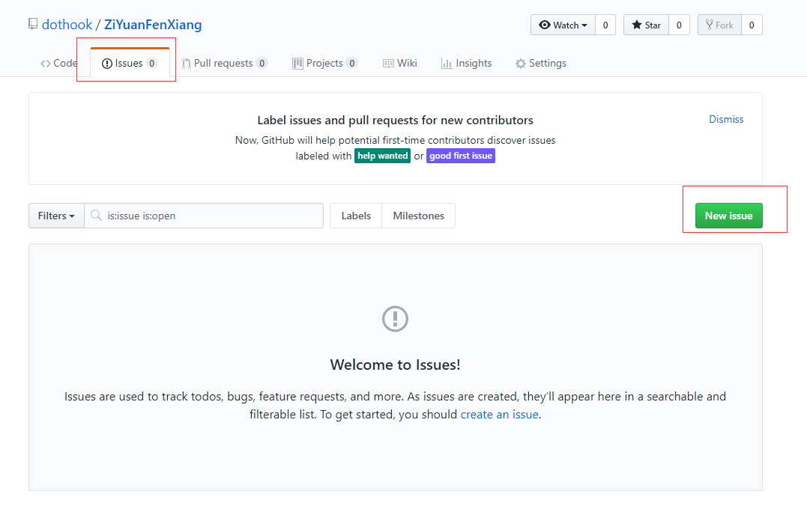

# 资源教程与书籍分享
加油~
## 编程
### C/C++
* 视频: 
    + C [小甲鱼 C语言教程](https://pan.baidu.com/s/1tbV6eHBAVAOVBgcg5YJC2Q) 提取码: `gx4y`
    + C++ [小甲鱼 C++快速入门](https://pan.baidu.com/s/1qmFrB8IoEalbEQXKmWcy4g)  提取码: `aevj`
    + C/C++ [数据结构与算法](https://pan.baidu.com/s/1nw8pFsWBrHJs20de1r1ing) 提取码 `hkxw`
* 书籍:
    + 《C++ primer》
    + 《Effective C++》
    + 《More effective C++》
* 编程规范:
    + [Google C++ Style Guide 英文原版](https://google.github.io/styleguide/cppguide.html) 
    + [Google C++ Style Guide 中文翻译](https://google.github.io/styleguide/cppguide.html)
### Windows 编程
* 视频: 
    + [小甲鱼 Windows SDK 教程(未完成)](https://pan.baidu.com/s/1pngM3TLC-e0QQ1P3N13Vsw) 提取码: `ubt3`
* 书籍(有C/C++基础的推荐直接看书籍):
    + 《Windows程序设计(第5版,珍藏版)》 入门
    + 《Windows核心编程》 入门
    + 《[WIN64驱动编程基础教程](http://www.m5home.com/bbs/thread-7971-1-1.html)》 TA大佬的一个教程 很牛逼
    + 《Windows内核安全与驱动开发》 驱动开发书籍
    + -------------------分割线(下面是我还未读过的)-------------------
    + 《Windows 内核情景分析 上》
    + 《Windows 内核情景分析 下》
        - ...
### Java
* 视频: 很无奈没心思学 Java 目前使用都是将它当作有垃圾回收机制的C++编写，并只用于 Android 开发
* 书籍: 还未有时间拜读书籍
* 编程规范: 可以看下 《阿里巴巴Java开发手册》 
* 补充： 因为都是以C++的思维来看Java相关语法，依靠IDEA 和 Android studio 强大功能来编写代码，对于Java底层机制不是很了解，今后要好好学习一下Java。
* EX: Java有个 JNI 以后也可以研究下
### Android
* 书籍: 《第一行代码 Android》 
* 补充： 对照书籍相关代码功能进行复现，一个初入门状态。
### Node.js
* 视频: [Node.JS-7天-黑马程序员](https://www.bilibili.com/video/av27670326?from=search&seid=9851942222937173995) 有C++ JavaScript基础蛮简单的,很有意思的语言,用的 `Google V8` 引擎 `NPM`很强大
* 有C++基础的可以看下 Node.js C++ API 编写C++扩展Node.js(其实类似V8扩展)
### Vue.js (前端)
* 补充: 需要前端基础`(Html CSS JavaScript)`
* 官方文档: [Vue.js](https://cn.vuejs.org/v2/guide/)
* 视频: [Vue.js](https://www.bilibili.com/video/av24826984?from=search&seid=4226900069019711864) 教程一般 有基础的可以看官方文档,配合教程中 Webpack 相关知识口味更佳
### Python (学习Web安全的 Python已经成为必学语言了, 推荐学习 Python3)
* 视频: 可以去 [B站](https://www.bilibili.com) 找找
* 书籍: 《Python核心编程》 我看的书
* 有C++基础的可以看下 Python C++ 扩展 在某些场景可以提高Python运行效率
* 库:
    + [Requests](http://docs.python-requests.org/zh_CN/latest/user/quickstart.html)
    + [BeautifulSoup4](https://beautifulsoup.readthedocs.io/zh_CN/v4.4.0/)
    + [Tensorflow](https://tensorflow.google.cn/) `机器学习`
    + [Django](https://www.djangoproject.com/)
    + [Flask](http://docs.jinkan.org/docs/flask/)
### Electorn `(很有意思的一个库,可以用 Html+css+JavaScript+Node.js来写桌面应用程序)`
* [Electorn 官方文档](http://electronjs.org/docs)
### PHP
* 不难 [官方文档](http://php.net/manual/zh/) 基础打好 语法和C++类似
* [Thinkphp](http://www.thinkphp.cn/)

## 逆向
### 汇编语言
* 视频:
    + [小甲鱼汇编基础(王爽汇编)](https://pan.baidu.com/s/1t3wV4GNlHurn5yXpU2ItEA) 提取码: `gp13`
    + [小甲鱼Win32(x86)汇编(废弃但是可看)](https://pan.baidu.com/s/1UuhM9eM4TH0KRzIleHmFHw) 提取码: `btwh`
### 解密系列
* 视频:
    + [小甲鱼基础篇](https://pan.baidu.com/s/1yexO-tEMKdAb2ylBS6m9mQ) 提取码: `wuaq`
    + [小甲鱼OD教程](https://pan.baidu.com/s/1gIjAKxbS-vLg_rgTKGk5dA) 提取码: `skj7`
    + [小甲鱼脱壳篇](https://pan.baidu.com/s/1SCCf6ll5f5lRDTSu-BgaQg) 提取码: `wi75`
    + [小甲鱼密码学](https://pan.baidu.com/s/1-MR0yI0r20n8o4CvmzBjcw) 提取码: `4pu9`
    + [小甲鱼系统篇(PE结构)](https://pan.baidu.com/s/1cj6LU6xwfa5BecjBZUTkZw) 提取码: `p5cn`
    + [小甲鱼工具篇](https://pan.baidu.com/s/1lUjUgRulOE2c3HhNlxKxDQ) 提取码: `9gkb`
### 外挂系列 （学逆向的时候痴迷了段时间，被游戏保护按在地上摩擦）
* 放两个教程吧 蛮老了的有兴趣可以自己深入研究
    + [郁金香VC外挂教程](https://pan.baidu.com/s/1OuPeVTL0vDY8lJT4OWOSKw) 提取码: `fqai` 蛮老的
    + [小冷的(易语言的)](https://pan.baidu.com/s/1fVWSNsu_kodW8WfTUSaM4w) 提取码: `xd7a` 易语言不用特意去学, 简单的很
    + 把CE操熟了还是很好玩的
### 书籍:
* 看雪的 《加密与解密》

## Web 安全
### 书籍推荐
* 《黑客攻防入门技术宝典 Web实战篇》 必读
* 《白帽子讲Web安全》 必读
* 《Web前端黑客技术揭秘》 必读
* 《黑客秘籍 - 渗透测试实用指南》 工具书
* 《Metsploit 魔鬼训练营》 Metsploit用法
### 技术论坛
* [GitHub](https://github.com/) 各种漏洞POC都可以来这找 是全球最大的开源社区，代码托管平台，黑客与开发者的聚集地
* [Freebuf](https://www.freebuf.com/) 黑客与极客
* [安全客](https://anquanke.com)
### 工具
* burpsuite 一定要熟练 做Web安全 Http数据分析利器 有着各种各样的扩展插件
    * [burpsuite实战指南](https://t0data.gitbooks.io/burpsuite/content/) 教程
* nmap
    * [不老神器NMAP](https://www.freebuf.com/news/141607.html)
* Sqlmap
    * `git clone https://github.com/sqlmapproject/sqlmap.git`
* metasploit
* Empire Powershell [Empire](http://www.powershellempire.com/) 后渗透神器
### 靶机系统
* Webgoat
* DVWA
## 操作系统
* Linux
    + 鸟哥 Linux 私房菜
* Windows Server
    + emm没具体取学
## 其他
* Git 使用教程
    - [廖雪峰老师的Git教程](https://www.liaoxuefeng.com/wiki/0013739516305929606dd18361248578c67b8067c8c017b000)

## 持续更新
如果你觉得还不错，不介意的话点个 `Star`
你可以在 issues 向我留言 首先你要注册Github

